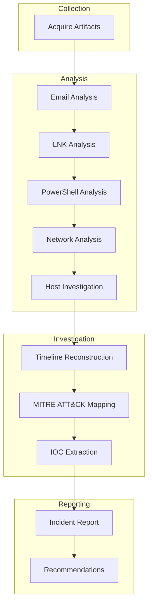

# Boogeyman APT - Digital Forensics & Incident Response Investigation

A complete **Digital Forensics and Incident Response (DFIR)** investigation simulating a targeted spear-phishing attack against **Quick Logistics LLC**. This report reconstructs the full attack lifecycle from the initial phishing email through command-and-control communication, host reconnaissance, credential theft, and DNS-based data exfiltration—using forensic artifacts collected from the compromised workstation.

---

# Investigation Objectives

- Identify the initial compromise vector.
- Reconstruct the complete attack timeline.
- Analyze attacker Tactics, Techniques, and Procedures (TTPs).
- Investigate PowerShell-based command execution.
- Correlate host, network, and email artifacts.
- Determine the scope and impact of the incident.
- Recover the exfiltrated data and validate its contents.
- Map observed behaviors to the MITRE ATT&CK framework.
- Produce a professional DFIR report with actionable recommendations.

---

# Investigation Artifacts

The investigation is based on multiple forensic evidence sources, including:

- 📧 Phishing email (`dump.eml`)
- 🌐 Network capture (`capture.pcapng`)
- 📜 PowerShell Script Block Logs (Event ID 4104)
- 📂 Malicious LNK attachment analysis
- 🔐 Encoded and decoded exfiltrated data
- 💻 PowerShell execution logs
- 🧩 Windows forensic artifacts
- 🖼️ Investigation screenshots captured from the analysis VM

---

# Tools Used

### Network Analysis
- Wireshark
- Tshark

### Windows Forensics
- Event Viewer
- EvtxECmd / Evtx2Json
- LNKParse3

### Command-Line & Data Processing
- PowerShell
- jq
- awk
- grep
- cut
- tr
- uniq

### Threat Intelligence
- VirusTotal

---

# Investigation Workflow



---

# Report Contents

- Executive Summary
- Investigation Preparation
- Incident Architecture
- Email Analysis
- Attachment Analysis
- Execution Analysis
- PowerShell Analysis
- Network Analysis
- Discovery Activities
- Credential Collection
- DNS Exfiltration Analysis
- Impact Assessment
- Indicators of Compromise (IOCs)
- MITRE ATT&CK Mapping
- Timeline Reconstruction
- Incident Conclusion
- Detection Opportunities
- Security Recommendations

---

# Attack Summary

A finance employee at **Quick Logistics LLC** received a targeted phishing email impersonating a trusted business partner. The email delivered a password-protected ZIP archive containing a malicious Windows Shortcut (LNK) file.

Execution of the LNK launched an obfuscated PowerShell stager that downloaded additional payloads, established an HTTP-based command-and-control channel, and enabled interactive attacker access.

The attacker performed host reconnaissance using Seatbelt, recovered a KeePass master password stored in Windows Sticky Notes, accessed a password database containing corporate credit card information, and exfiltrated the database through DNS queries by encoding its contents into hexadecimal chunks.

The observed tradecraft closely aligns with publicly documented activity attributed to the **Boogeyman** threat group targeting organizations within the logistics sector.

---

# MITRE ATT&CK Highlights

| Tactic | Technique |
|---------|-----------|
| Initial Access | T1566.001 – Spearphishing Attachment |
| Execution | T1059.001 – PowerShell |
| Execution | T1204.002 – User Execution |
| Command & Control | T1071.001 – Application Layer Protocol (HTTP) |
| Discovery | T1082 – System Information Discovery |
| Credential Access | T1555 – Credentials from Password Stores |
| Collection | T1005 – Data from Local System |
| Exfiltration | T1048 – Exfiltration Over Alternative Protocol (DNS) |

---

# Repository Structure

```text
.
├── report/
│   └── Boogeyman_APT_DFIR_Report.md
│
├── artifacts/
│   ├── dump.eml
│   ├── output_of_lnkparse_invoice.txt
│   ├── powershell_json_after_jq.txt
│   ├── ScriptBlockText.txt
│   ├── encoded_exfiltrated_data.txt
│   └── decoded_exfiltrated_data.txt
│
├── images/
│   ├── mail.png
│   ├── pcap.png
│   ├── timeline.png
│   ├── architecture.png
│   └── ...
│
└── README.md
```

---

# Skills Demonstrated

- Digital Forensics
- Incident Response
- Email Forensics
- Windows Event Log Analysis
- PowerShell Forensics
- LNK File Analysis
- Network Traffic Analysis
- DNS Exfiltration Analysis
- Threat Hunting
- Timeline Reconstruction
- IOC Extraction
- MITRE ATT&CK Mapping
- Malware Behavior Analysis
- Threat Intelligence Correlation
- Technical Report Writing

---

# License

This project was created for **educational and portfolio purposes only**.

The investigation is based on a simulated incident response scenario and is intended to demonstrate Digital Forensics and Incident Response (DFIR) methodologies.